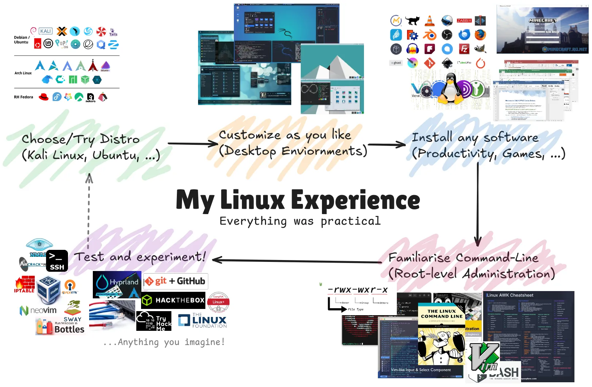

# I'm miniMinn | Linux & Cybersecurity Enthusiast
I enjoy doing pretty much stuffs with my home lab - to familiarize myself with latest real-world tech.

- 🐧 My primary desktop is Arch Linux with Hyprland environment.
- 📝 I frequently share my open-source/CS contents, project walkthrough, and knowledge on [LinkedIn](https://www.linkedin.com/in/minn-maung-maung-03352028a/), [Facebook](https://www.facebook.com/profile.php?id=100087719122627), [Instagram](https://www.instagram.com/miniminn_ig?igsh=aWIyZjhsa2FiaGhs), [X (Twitter)](https://x.com/miniMinn24?t=CjacvDF0KcV51epICnFI7g&s=09).
- 📫 Reach me on: miniminnmgmg24@gmail.com
- 😄 Pronouns: He/Him

## Skills
    
   
   

   

   

## Certifications and Training
<!--START_SECTION:badges-->

<!--END_SECTION:badges-->

If you wanna do projects, talk, share or anything, feel free to network with me anytime!
I'm socially welcome ;)

## Social Networking

   

## Get in Touch

