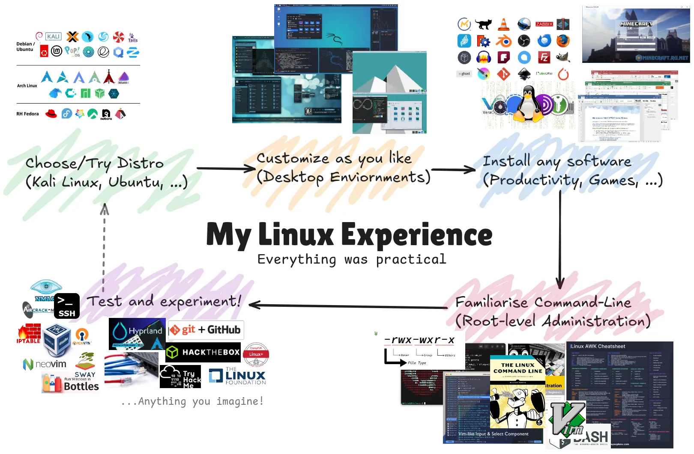
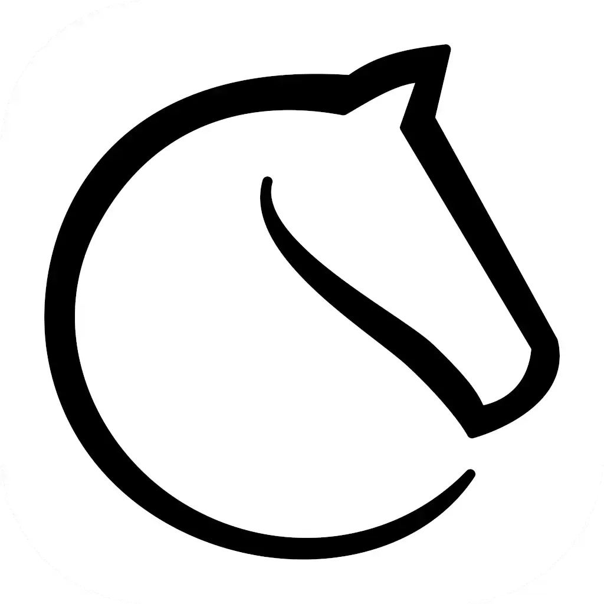

# I'm miniMinn | Linux & Cybersecurity Enthusiast (>. < )

> [!NOTE]
> My **self-hosting portfolio** here: [Writeups/Knowledge Base](https://miniminn24.github.io/Obsidian_Notebook)

Hello, I'm a L4DC 1st year student of NCC Education Ltd., and I pretty much enjoy doing many stuffs with my home lab - including Windows/Linux OS management, network projects, and cybersecurity analyst labs to actively familiarize myself with a critical **problem-solving mindset**.

- 🐧 My primary desktop is Arch Linux with Hyprland environment.
- 📚 As an active learner, I study practical courses from Coursera, HackTheBox, and YouTube.
- 📝 I share my open-source/CS contents, project walkthrough, and knowledge on [LinkedIn](https://www.linkedin.com/in/minn-maung-maung-03352028a/), [Facebook](https://www.facebook.com/share/17VUdL46FU/), [Instagram](https://www.instagram.com/miniminn_ig), [X (Twitter)](https://x.com/miniMinn24).
- 📫 Reach me on: miniminnmgmg24@gmail.com
- 😄 Pronouns: He/Him

## Certifications and Training
<!--START_SECTION:badges-->

<!--END_SECTION:badges-->

## Skills
     

  

## Social Networking
Where I share my personal tech **blogs, Linux tips, and many resourceful contents**:

   

## Get in Touch
If you wanna do projects, talk, share or anything, feel free to network with me anytime!
_I'm socially welcome ;)_

