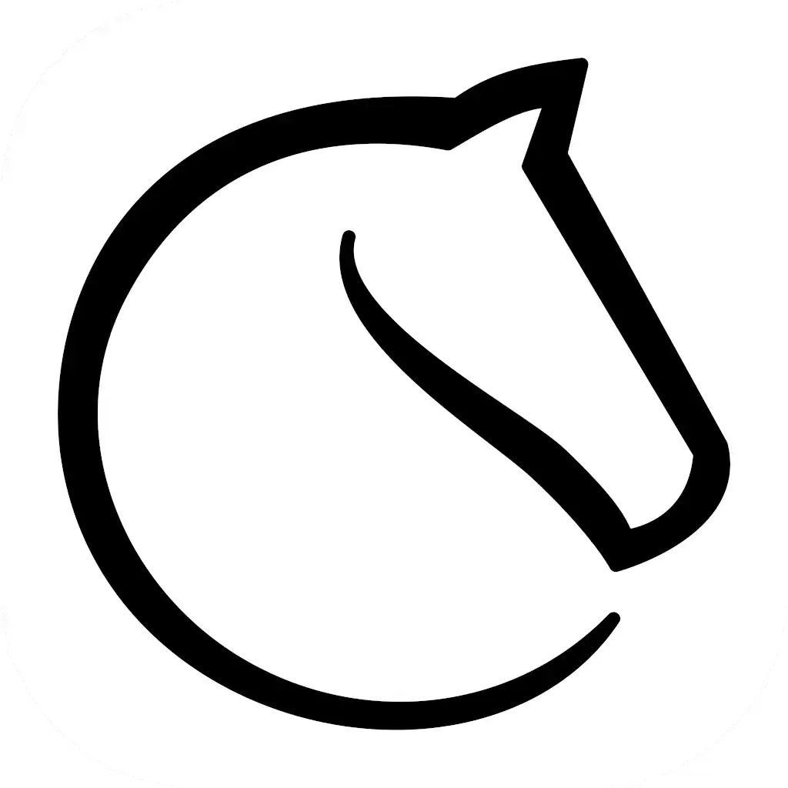

# I'm miniMinn | Linux & Cybersecurity Enthusiast

> [!IMPORTANT]
> My **self-hosting portfolio** is live here: [Writeups/Knowledge Base](https://miniminn24.github.io/miniMinn.md)

Hello, I'm a L5DC (2nd) year student of [NCC Education Ltd.](https://www.nccedu.com/). I pretty much enjoy doing my home lab: Windows/Linux OS management, network flow analysis, and weekly cybersecurity labs to actively familiarize myself with **problem-solvings**.

- 🐧 My primary desktop: Arch Linux x Hyprland
- 📚 Studying practical courses from Coursera, HackTheBox and YouTube as a part-time job.
- 📝 I share my open-source contents, walkthrough and knowledge notes on [Writeups/Knowledge Base](https://miniminn24.github.io/Obsidian_Notebook)
- 📫 Reach me on: miniminnmgmg24@gmail.com
- 😄 Pronouns: He/Him

## Certifications and Training
<!--START_SECTION:badges-->
<!--END_SECTION:badges-->

## Social Networking
Where I share my personal tech **blogs, Linux tips, and many resourceful contents**:

   

## Get in Touch
If you wanna do projects, talk, share or anything, feel free to network with me anytime!
_I'm socially welcome ;)_

